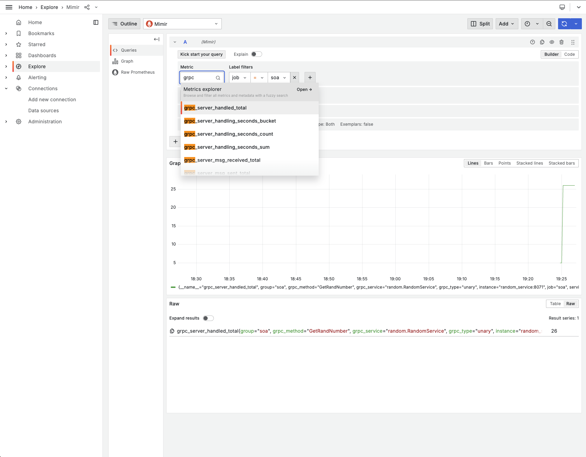
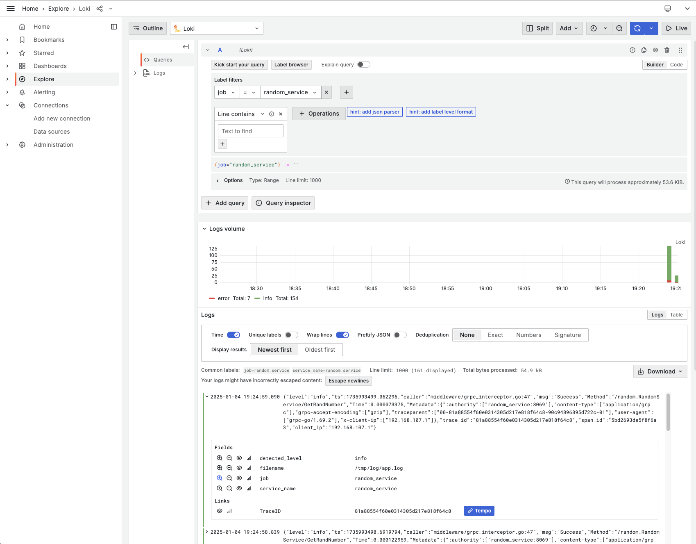
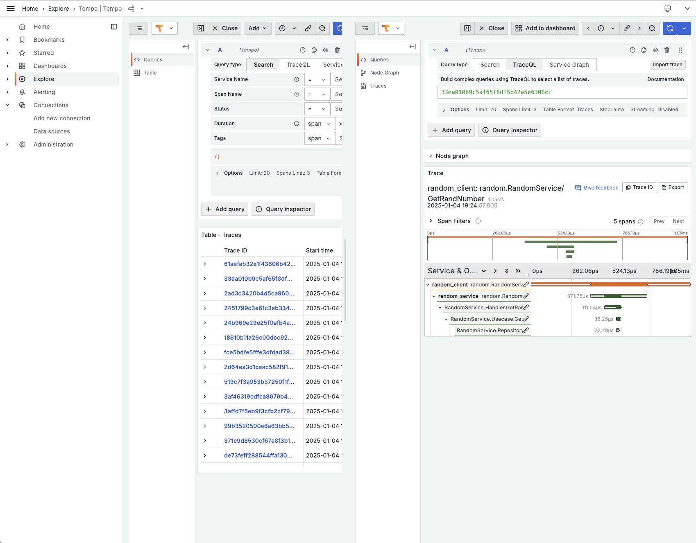

# soa-404

## How to run ?

Simply run `make run` and `curl "http://localhost:8070/random?seed=123"`.

## Access Grafana

Go to `http://localhost:9000` -> Explore

Change the datasources to `Mimir` to access the metrics, `Loki` to access the logs and `Tempo` for traces.

### Metrics

<figure>

  
  <figcaption>
Explore metrics
</figcaption>
  

</figure>

### Logs

<figure>

  
  <figcaption>
Explore logs
</figcaption>
  

</figure>

### Traces

<figure>

  
  <figcaption>
Explore traces
</figcaption>
  

</figure>

## Contributing

Feel free to fork or clone this repository, explore the code, and contribute by submitting pull requests. Contributions, whether they’re bug fixes, improvements, or new features, are always welcome!

## License

Distributed under the GPLv3 License. See `LICENSE.md` file for more information.
